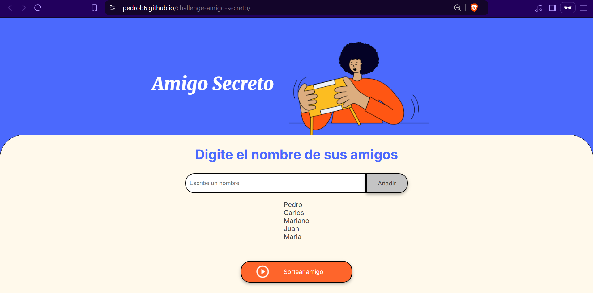

# Challenge del amigo secreto

----------------------------  

# Índice
- [1.Instalación](#1-Instalación)
- [2.Descripción](#2-Descripción)
- [3.Instrucciones](#3-Instrucciones)
- [4.¡A jugar!](#4-A-jugar-)

----------------------------               

# 1. Instalación
Sigue a continuación los siguientes comandos:

```bash
# Clona este repositorio
git clone https://github.com/PedroB6/challenge-amigo-secreto.git

# Entra en el directorio del proyecto
cd challenge-amigo-secreto

```

# 2. Descripción

El propósito de este proyecto fue aplicar los conocimento en lógica de programación con JavaScript para listar varios nombres de amigos, poder sortearlos y solo mostrar en pantalla uno, en el siguiente apartado se detalla el paso a paso.

# 3. Instrucciones

1. Ya se cuenta con una página web, por lo que solo se debe dirigir al siguiente link: 
[Link de la página web](https://pedrob6.github.io/juego-secreto/)

2. En el espacio de "Escribe un nombre", se digita el primer nombre para entrar al sorteo:


4. Para el caso de este ejemplo, se escribe "Pedro" y se da click en el botón de :


5. Se verá reflejado el nombre escrito ("Pedro" para este caso), en la parte inferior del recuadro:


6. Se hace lo mismo para los siguientes nombres, repitiendo los pasos 2 y 3, hasta terminar con todos los nombres de los amigos, en este ejemplo, los amigos que se tienen son los de Pedro, Carlos, Mariano, Juan y Maria:


7. Se da click en el botón  :


# 4. ¡A jugar!

¿Te animas a jugar este divertido reto?
¡Anímate, te desafio a hacerlo en un solo intento!

